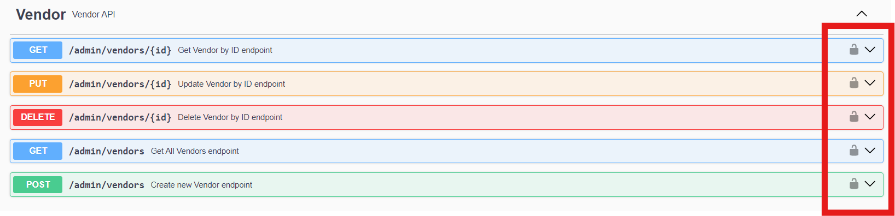
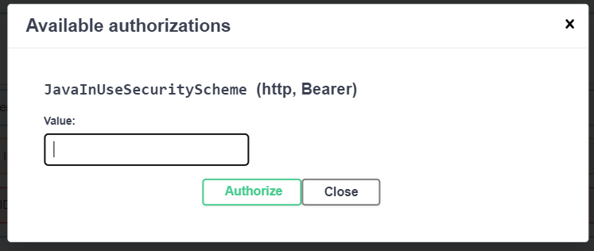

# Vendor Management System (VMS)

This project is a Vendor Management System built using Java. The application is containerized and can be run using Docker.

## Table of Contents
- [Prerequisites](#prerequisites)
- [Build the Docker Image](#build-the-docker-image)
- [Run the Application](#run-the-application)
- [Stop and Remove the Container](#stop-and-remove-the-container)
- [Accessing the Application](#accessing-the-application)
- [Accessing the API Documentation](#accessing-the-api-documentation)
- [JWT Authentication for Admin Operations](#jwt-authentication-for-admin-operations)
- [Rate Limiting on /auth/login](#rate-limiting-on-authlogin)
- [Troubleshooting](#troubleshooting)
- [Additional Notes](#additional-notes)

## Prerequisites

Before running the application, ensure you have the following installed on your machine:
- [Docker](https://docs.docker.com/get-docker/) (Version 20.x or higher recommended)

## Build the Docker Image

1. Clone the repository to your local machine:

    ```bash
    git clone https://github.com/your-username/vendor-management-system.git
    cd vendor-management-system
    ```

2. Ensure that the `Dockerfile` is present in the project root directory.

3. Build the Docker image using the following command:

    ```bash
    docker build -t vms-demo .
    ```

    - **`vms-demo`**: The tag name for the image. You can change it to anything you prefer.
    - **`.`**: This specifies the current directory where the Dockerfile is located.

4. Once the image is built, verify it by listing your Docker images:

    ```bash
    docker images
    ```

   You should see the image `vms-demo` in the list.

## Run the Application

1. Run the Docker container using the image you just built:

    ```bash
    docker run -p 8081:8081 --name vms-demo-rest vms-demo
    ```

    - **`-p 8081:8081`**: Maps port `8081` of the Docker host to port `8081` in the container where the application is listening.
    - **`--name vms-demo-rest`**: Gives a name to the running container.
    - **`vms-demo`**: The name of the image to run.

2. After running the command, the application will start inside the container and expose port `8081`.

## Stop and Remove the Container

To stop the container, run the following command:

```bash
docker stop vms-demo-rest
```

To remove the container after stopping it:

```bash
docker rm vms-demo-rest
```

## Accessing the Application

Once the application is running, you can access it in your browser by visiting:

```
http://localhost:8081
```

This will display the application running inside the Docker container.

## Accessing the API Documentation

The application includes API documentation using Swagger. You can access the Swagger UI by visiting:

```
http://localhost:8081/swagger-ui/index.html
```

This will provide the full documentation for all available REST operations in the Vendor Management System.

## JWT Authentication for Admin Operations

To perform any operations on the `/admin/vendor` endpoint, you must authenticate using JWT (JSON Web Token). Follow these steps to obtain and use the token:

### Steps for Authenticating:

1. **Log in as Admin**: Use the admin credentials to log in and retrieve your JWT token:
    - **username**: `budi@example.com`
    - **Password**: `password123`
2. **Access Authorization Header**:
    - When interacting with endpoints that require authorization, include the JWT token in the `Authorization` header.
    - The format for the header is as follows:
      ```
      Authorization: Bearer <your-jwt-token>
      ```

3. **Visual Guidance**:
    - In the API documentation (Swagger UI), click on the **lock icon** to add your JWT token for secured endpoints.
    - The following image demonstrates where to find the lock icon:

      

4. **Example**: After clicking the lock icon, enter the JWT token in the popup dialog and press **Authorize**. This will authorize your requests for protected endpoints. Refer to the image below for an example of the JWT token insertion process:

   

### Ensure Admin Role

Make sure the authenticated user has the `ROLE_ADMIN` assigned to access this endpoint.

## Rate Limiting on `/auth/login`

This application implements rate limiting on the `/auth/login` endpoint using **Resilience4j**. The rate limiter restricts the number of login attempts to enhance security and prevent abuse.

### Rate Limiting Configuration:

- **Requests per period**: Only 1 login attempt is allowed per client within a 5-second window.
- **Limit refresh period**: The rate limit is reset every 5 seconds.
- **Timeout duration**: If the rate limit is exceeded, the system will wait up to 2 seconds for the limit to reset before returning an error.
- **Health monitoring**: Rate limiter metrics and health status are available for monitoring.

### How it Works:

When a client makes a login request to the `/auth/login` endpoint, the following rate limiting rules apply:

1. **1 request per 5 seconds**: Each client can make only one login attempt every 5 seconds.
2. **Timeout handling**: If more than one login request is made within the 5-second window, the client will receive a `429 Too Many Requests` error after a 2-second wait time.
3. **Health metrics**: The rate limiter is registered with the health monitoring system to provide visibility into the rate limiting status.

### Example Response for Exceeding the Limit:

If the client exceeds the allowed number of login attempts, they will receive a `429 Too Many Requests` response:

```json
{
  "now": "2024-10-04T09:40:06.4396832",
  "message": "RateLimiter 'login' does not permit further calls"
}
```

### Accessing Rate Limiter Health Metrics:

To monitor the health of the rate limiter, access the application's health metrics, which will show the rate limiting status for the `/auth/login` endpoint. The health metrics can be used to observe the number of available permits and other statistics.

---

This section will help users understand how rate limiting is applied to the `/auth/login` endpoint and what to expect when the rate limit is exceeded.
## Troubleshooting

- **Container won’t start**: Ensure the image is built properly using `docker build`.
- **Port conflict**: Make sure port `8081` on your host machine is not being used by another application. If it is, you can change the host port when running the container, e.g., `-p 8082:8081` to map the container's `8081` to the host's `8082`.
- **Check container logs**: If there’s an issue, you can check the container logs by running:

    ```bash
    docker logs vms-demo-rest
    ```

## Additional Notes

- You can list all running containers with:

    ```bash
    docker ps
    ```

- To view all containers, including stopped ones, use:

    ```bash
    docker ps -a
    ```

--- 

This enhanced **README.md** now includes instructions for accessing the Swagger API documentation and how to use JWT authentication for admin operations.